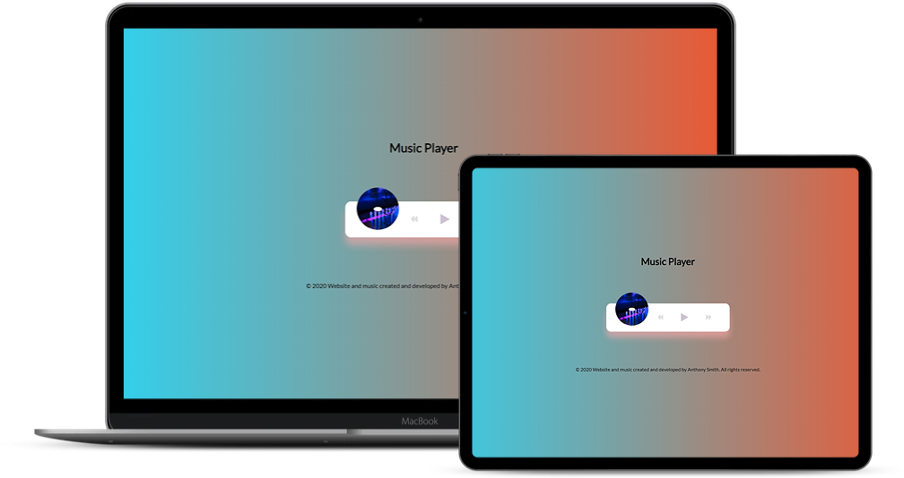

## Music Player

Create beautiful UI to play music stored in the "music folder" using the HTML5 audio API

 ## Project Specifications

- Create UI for music player including spinning image and song detail popup
- Add play and pause functionality
- Switch songs
- Progress bar
 
## Steps to execute this Music Player:
- Download the entire code 
- Open up the index.html.
- [View Live Site]()

## Technologies used: 
- HTML
- CSS
- Javascript

